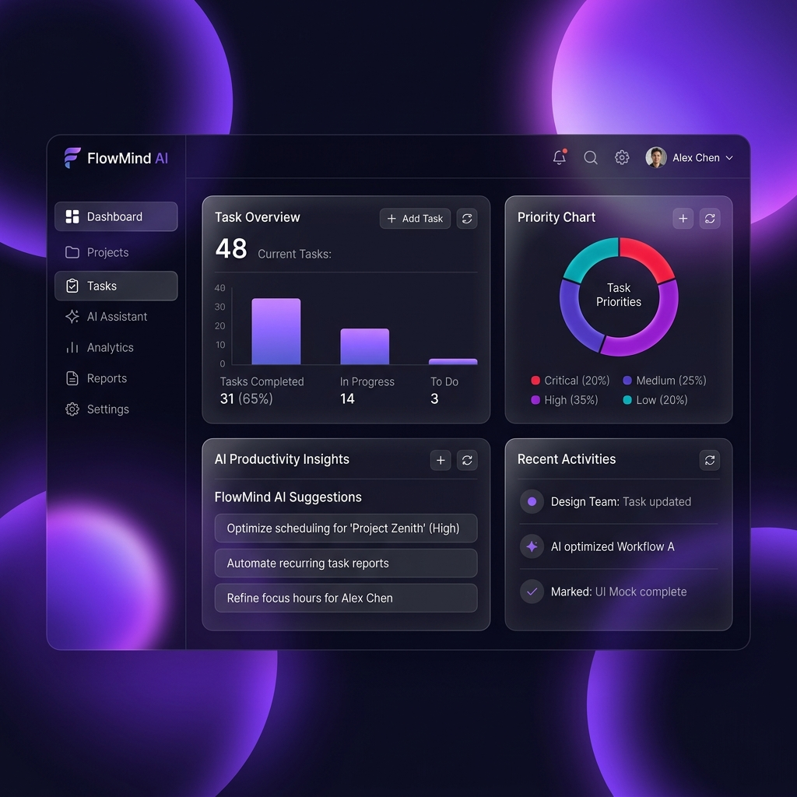
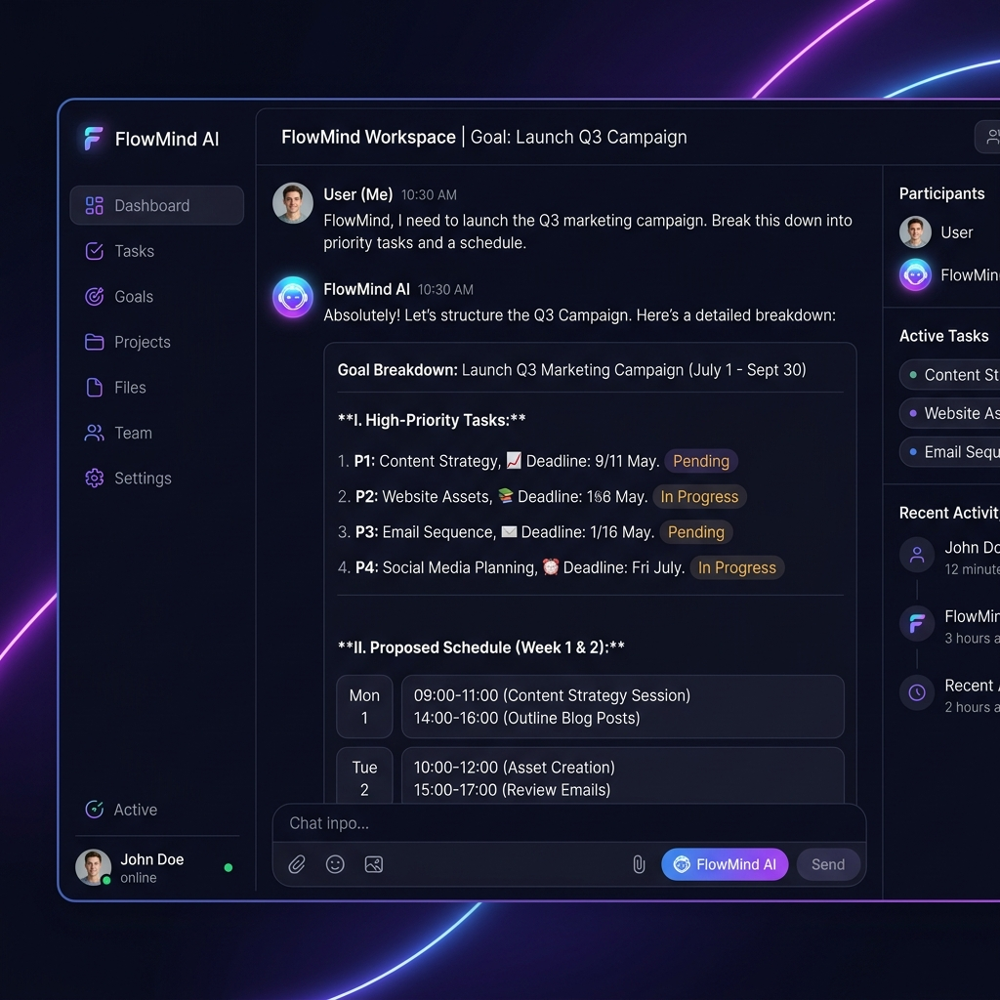

# FlowMind AI - AI Productivity Assistant

FlowMind AI is a premium, glassmorphic operations hub designed to automate administrative friction and optimize daily focus. By integrating a natural language AI chat workspace, a weighted priority task checklist, a daily schedule mapper, a smart outreach composer, and an intelligent PDF action-item extractor, it establishes a cohesive system where tasks and schedules flow seamlessly.

---

## Technical Architecture

```text
flowmind-ai/
├── backend/
│   ├── .env.example          # Template for backend settings
│   ├── main.py               # FastAPI server and Gemini API routes
│   └── requirements.txt      # Python dependencies
├── frontend/
│   ├── src/
│   │   ├── components/       # UI View pages (Dashboard, Chat, Task Manager, Planner)
│   │   ├── context/          # TaskContext (State management & Local Storage)
│   │   ├── App.jsx           # React routing & login layouts
│   │   ├── index.css         # Glassmorphism UI tokens & Tailwind imports
│   │   └── main.jsx          # Entry point
│   ├── index.html            # HTML shell with Google Fonts
│   ├── package.json          # Node dependencies
│   ├── tailwind.config.js    # Tailwind v4 configuration
│   └── vite.config.js        # Vite compilation & dev proxy rules
├── LICENSE                   # MIT License
├── .gitignore                # Version control exclusions
└── README.md                 # Project documentation (this file)
```

---

## Visual Previews

### 📊 Dashboard Overview

*A dark-themed analytics landing page displaying live completion statistics, task priority charts, and automated productivity tips.*

### 💬 AIWorkspace Conversational Chat

*An interactive console that breaks complex goals down into sub-tasks and schedules.*

---

## Features

1. **AI Workspace Room**: Input natural language goals (e.g. *"I need to study machine learning today"*), and the AI compiles estimated tasks and hourly schedules that you can add to your active boards with one click.
2. **Smart Task Matrix**: Dynamic priority matrix utilizing weighted completion scoring (High: 3 points, Medium: 2 points, Low: 1 point) to calculate your live daily productivity quotient. Syncs instantly to `Local Storage`.
3. **Availability Schedule Mapper**: Map available time intervals (*"I have 4 hours today"*) against selected checklist tasks to generate chronological schedule timelines and strategy tips.
4. **Document OCR & Action Checkbox Extractor**: Upload PDF document pages to summarize core concepts, list takeaways, and parse actionable checkboxes for direct checklist import.
5. **Outreach Draft Composer**: Generate formal, casual, or urgent outreach email templates based on user contexts, with instant clipboard copy panels.
6. **Live Analytics**: Visualizes task allocations by priority using Recharts.

---

## Tech Stack

- **Frontend Core**: React (v19), React Router Dom (v7), Axios Client
- **Styling**: Tailwind CSS (v4), Google Fonts (Outfit, Plus Jakarta Sans), Glassmorphic CSS design tokens
- **Data Persistence**: React Context API, Web LocalStorage API
- **Charts & Visuals**: Recharts (Responsive bar charts), Lucide React (Icons)
- **Backend API**: Python FastAPI, Uvicorn, Python-multipart (Uploads)
- **Document Parser**: PyPDF
- **AI Core**: Google Gemini API, utilizing `gemini-3.5-flash` for low-latency JSON structured outputs

---

## Installation & Setup

### Prerequisites
- **Node.js** (v18 or higher)
- **Python** (v3.10 or higher)
- **Gemini API Key** (from Google AI Studio)

---

### 1. Backend Setup

1. Navigate to the `backend` directory:
   ```bash
   cd backend
   ```
2. Create and activate a virtual environment:
   ```bash
   # Windows (PowerShell)
   python -m venv venv
   .\venv\Scripts\Activate.ps1
   
   # macOS/Linux
   python -m venv venv
   source venv/bin/activate
   ```
3. Install package requirements:
   ```bash
   pip install -r requirements.txt
   ```
4. Configure env parameters:
   - Copy `.env.example` to `.env`
     ```bash
     copy .env.example .env
     ```
   - Edit the newly created `.env` file and insert your Google Gemini API Key:
     ```env
     GEMINI_API_KEY=AIzaSy...
     ```
5. Start the FastAPI server:
   ```bash
   python main.py
   ```
   The backend API is now running on `http://localhost:8000`.

---

### 2. Frontend Setup

1. Open a new terminal session and navigate to the `frontend` directory:
   ```bash
   cd frontend
   ```
2. Install npm dependencies:
   ```bash
   npm install
   ```
3. Start the Vite development server:
   ```bash
   npm run dev
   ```
4. Load the application: Open [http://localhost:5173/](http://localhost:5173/) in your web browser.
   - Enter mock email `pranav.patil@flowmind.ai` on the login screen to access the workspace.

---

## Future Scope

1. **CalDAV Calendar Syncer**: Implement calendar integration to export daily schedule blocks straight to Google Calendar or Apple Calendar.
2. **Local RAG Vector Embeddings**: Allow uploading folders of document resources to search and reference contexts locally inside the chat view.
3. **Collaboration Syncs**: Add real-time task board sharing and workspace collaboration using WebRTC.

---

## License

Distributed under the MIT License. See [LICENSE](./LICENSE) for more details.
